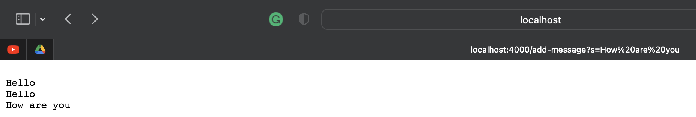

# Part 1: Writing a webserver

My code for StringServer:



In the above screenshot, The main method within StringServer is called to start the server and begin handling arguments then method handlerequest is called to take in new arguments put in the URL. In this case, I inserted "Hello", then "Hello" again, then "How are you". handlerequest takes in the parameter url and returns a query which is then split to get our intended message, and then it calls parameter[1] to store these inputs in the array list "sentences" using the sentences.add() function. Then I stored all the elements of my arraylist into a string called str to hold all the arguments separated by a new line. Finally, I returned str to display all three inputs on separate lines. 


In the above screenshot, The main method within StringServer is called to start the server and begin handling arguments then method handlerequest is called to take in new arguments put in the URL. In this case, I inserted "Hello", then "Hello" again, then "How are you", then "This is Mahmoud". handlerequest takes in the parameter url and returns a query which is then split to get our intended message, and then it calls parameter[1] to store these inputs in the array list "sentences" using the sentences.add() function. Then I stored all the elements of my arraylist into a string called str to hold all the arguments separated by a new line. Finally, I returned str to display all four inputs on separate lines. 


# Part 2: Explaining and fixing bugs
Failure inducing input (JUnit): The input is { 3, 2, 1, 0 } and the expected output is { 0, 1, 2, 3}.
```
@Test public void myTestReverseInPlace() {
    int[] input1 = { 3, 2, 1, 0 };
    ArrayExamples.reverseInPlace(input1);
    assertArrayEquals(new int[]{ 0, 1, 2, 3}, input1);
} 
```
  
Failure inducing input (JUnit): The input is { 3, 2, 1, 0 } and the expected output is { 0, 1, 2, 3 }.
```
@Test
  public void myTestReversed() {
    int[] input1 = { 3, 2, 1, 0 };
    assertArrayEquals(new int[]{ 0, 1, 2, 3 }, ArrayExamples.reversed(input1));
} 
```
  
  
  Non Failure inducing input (JUnit): The input is an empty array { } and the expected output is an empty array { }. 
  ``` 
  @Test public void testReversed() {
    int[] input1 = { };
    assertArrayEquals(new int[]{ }, ArrayExamples.reversed(input1));
  } 
  ```
  
  Non Failure inducing input (JUnit): The input is {3} and the expected output is {3}.
  ``` 
  @Test public void testReverseInPlace() {
    int[] input1 = { 3 };
    ArrayExamples.reverseInPlace(input1);
    assertArrayEquals(new int[]{ 3 }, input1);
  } 
  ```
  
  The symptoms for reversed():
  
  These symptoms show that at element 1 in the array a 1 was expected but there was a 0. This is because a bug in the method causes it to copy from parts of the array that had already reversed. This must be fixed by making a new array to copy from. 
  
  The symptoms for reverseInPlace():
  
  These symptoms show that at element 2 in the array a 2 was expected but there was a 1. This is because a bug in the method causes it to return the original array. This specific bug would be solved by returning the new array. 
  
  Before fixing the bugs in reverseInPlace(): 
  ```
  static void reverseInPlace(int[] arr) {
    for(int i = 0; i < arr.length; i += 1) {
      arr[i] = arr[arr.length - i - 1];
    }
  } 
  ```
  
  After fixing the bugs in reverseInPlace(): 
  ```
  static void reverseInPlace(int[] arr) {
    int length = arr.length;
    for(int i = 0; i < length / 2; i++) {
      int tempVal = arr[i];
      arr[i] = arr[length - i - 1];
      arr[length - i - 1] = tempVal;
    }
  }
  ```
  
  What the bugs were in reverseInPlace() were: The issue with this code is that after it crosses the mid point of the array, it will start copying from 
  the already changed elements which will lead to an inaccurate reversed array. I fixed this by we use a temporary variable ``tempVal`` to store the value at the current i index. Then the value on the other end, ``arr[length - i - 1]`` is assigned to the current index i. Finally, the stored value in tempVal is assigned to the opposite end ``arr[length - i - 1]``. The loop only runs length / 2 times to make sure that each pair of values is swapped only once.
  
  
  Before fixing the bugs in reversed(): 
  ```
  static int[] reversed(int[] arr) {
    int[] newArray = new int[arr.length];

    for(int i = 0; i < arr.length; i += 1) {
      arr[i] = newArray[arr.length - i - 1];
    }
    return arr;
  } 
  ```
  
  After fixing the bugs in reversed(): 
  ``` 
  static int[] reversed(int[] arr) {
    int[] newArray = new int[arr.length];

    for(int i = 0; i < arr.length; i += 1) {
      newArray[i] = arr[arr.length - i - 1];
    }
    return newArray;
  } 
  ```
  
  What the bugs were in reversed(): The bugs with this code was that it created newArray with the same length as array but no elements because It didn't copy the elements. After that it proceeded to copy null elements into the original array then returned the original array. I fixed the code by copying the elements from original array in reverse order into newArray then returned the new array.
  
  
  
  
  
  
  
  
  # Part 3: What I learned from lab in weeks 2 & 3

I was very to learn about the URL interface, I didn't think it would be that simple and I felt good to be able to build something like that. I found it especially interesting to learn that I could store past arguments into an array to keep track of them. I was also happy to practice my debugging skills and deepen my understanding of JUnit in Lab 3. 
  
  
  
  
  
  
