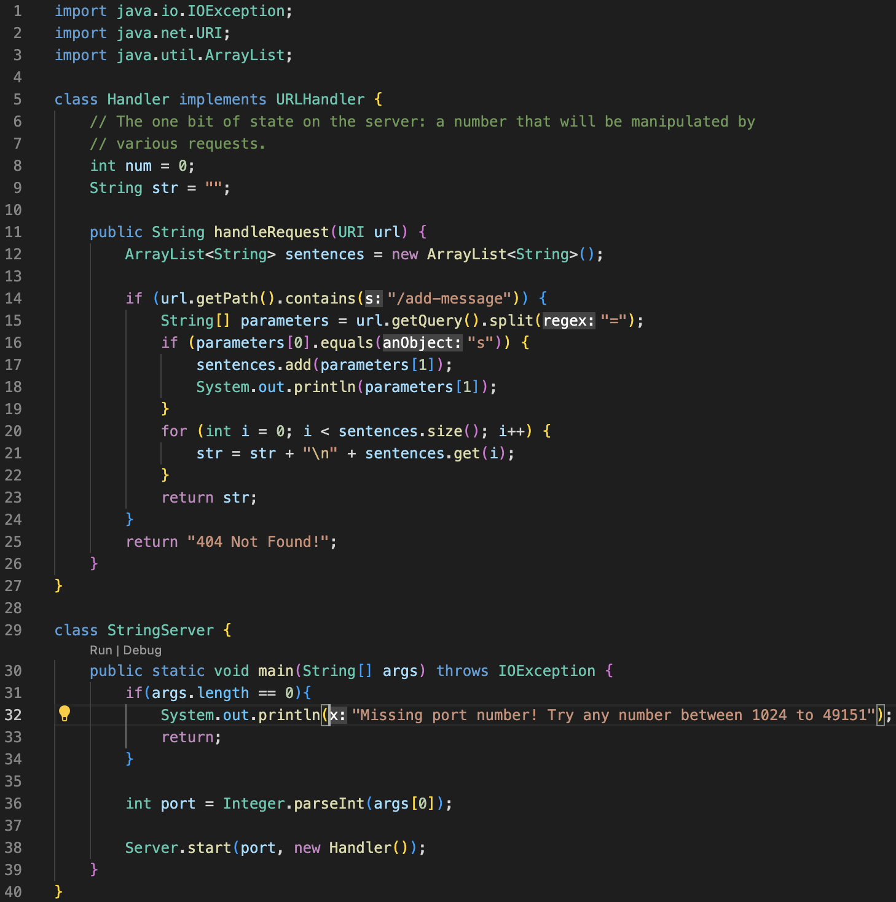

Step 4: I typed in `ssh` then copied and pasted `cs15lwi23ahv@ieng6.ucsd.edu` from notion using <Command> <V> and pressed <Enter>. This prompted a password. 
Then I typed in my password and pressed <Enter>. This brought up details of my login. 

Step 5: I typed git clone into the terminal then used <Command> <V> to paste the link to the terminal and pressed <Enter>.

Step 6: I typed `cd lab7` to change into the directory then pressed <Enter>.
I typed in `javac -cp .:lib/hamcrest-core-1.3.jar:lib/junit-4.13.2.jar *java` and pressed enter to compile.
Then I typed in `java -cp .:lib/hamcrest-core-1.3.jar:lib/junit-4.13.2.jar org.junit.runner.JUnitCore ListExamplesTests` to run the tests from ListExamplesTests.

  
Step 7: Typed in nano ListExamples.java and pressed <enter>. 

Keys pressed <down> <down><down><down><down><down><down><down><down><down><down><down><down><down><down><down><down><down><down><down><down><down><down><down><down><down><down><down><down><down><down><down><down><down> <right><right><right><right><right><right><right><right><right><right><right><right><delete> typed `2` <control><o><cntrl><o><enter><cntrl><x>
